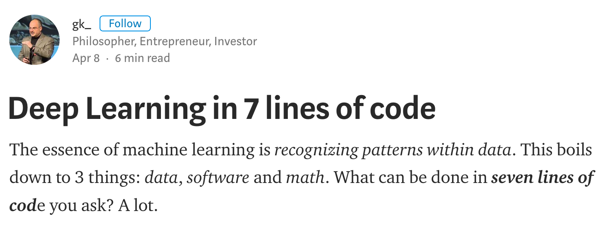
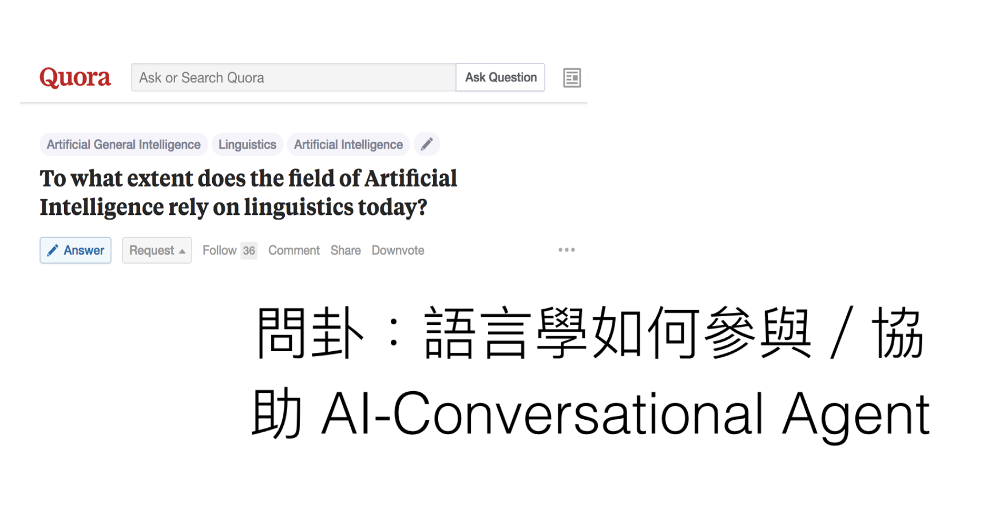

## Outline

> 1. AI, Deep Learning, and the (unknown) Future
> 2. Linguistics and AI : a (mis)match in Heaven?
> 2. Semantic Network: Representation, Memory and Processing
> 3. AI, AAI and AW?


---
## 時代背景：我的 ** 不是人


---
## 常被大眾談論（與誤解）的例子

- 語音辨識 = 語言理解 
- (語音辨識 + 字串關聯比對的) 聊天機器人 = AI

> 繼 `語音` 之後，`語意`（理解）是關鍵。

---
## AI: 目前走多遠了

- **知識搜尋處理**  決策、推薦、預測、推理、、
- **感知 (辨識)**  視覺（人臉、圖形、物件）、語音與語言、情緒、、
- **生成**  圖文詩詞自動生成、語音與音樂合成、娛樂商務與療癒對話、、

https://www.slideshare.net/ckmarkohchang/neural-art-english-version

---
## Deep Learning and Language Technology


`Real Time American Sign Language Video Captioning using
Deep Neural Networks`

---
## 機器可以自學？**可以!**


---
## 機器可以自學？**可以嗎?**

- Elon Musk (Tesla) vs Mark Zuckerberg (FB)
- Singularity: AI 的高鐵過站隱喻。


--- .cover .w #FitToWidth
## AI


---
## AI, Neural Network (aka Deep Learning)


---
## (End-to-End) AI 實作快變成中學生的課外活動




---
## Keras: Deep Learning library in R or Python within 30 seconds

```{r, eval=FALSE}


```


---
## Issues

- 不是每個領域都有可得的大數據 (big data)。
- 不是每個問題都有標準答案 (labeled data)。
- 理解活動可能不是模型或是序列匹配 (pattern matching/seq2seq chatbot)

---
## 這不是我們所理解的「理解」吧？

 `YOU: My _1_ is _2_`   
 `ELIZA: How long has your _1_ been _2_ ?`
 
 
 `YOU: _1_ 覺得我很 _2_`  
 `CELIZA: 那妳覺得妳很 _2_ 嗎？`

---
##  資料夠大也不一定穩定


--- 
## Deep (Linguistic) Learning: batteries included?

But, which Semantics?

- Lexical Semantics
- Neural Semantics
- Vector Semantics


---
## Network Representation of Semantics

<iframe width="520" height="415" src="assets/widgets/nn.html" frameborder="0" allowfullscreen></iframe>


---
## Network Analysis

`micro motifs and macro behavior`
- focuses on (in)dependent actors at the `micro level` and the consequences of their behavior at the `macro level`.
- *ideographic* approach stresses the uniqueness of a phenomenon; *nomothetic* approach stresses law-likeness.

---
## **Small worlds**: 
'six degrees of separation' (Watts and Strogatz, 1998)
```{r}
sw <- sample_smallworld(dim=2, size=10, nei=1, p=0.1)
plot(sw, vertex.size=6, vertex.label=NA, layout=layout_in_circle)
```

---
## Lexical network ([`Chinese Wordnet`]())


---
## Vector Semantics

- Like the **neural language models**, the `word2vec` models learn embeddings by training
a network to predict neighboring words.


---
## Vector Semantics 
Word Embeddings

<!--
<iframe width="800" height="515" src="http://140.112.147.121:8288" frameborder="0" allowfullscreen></iframe>  -->

<!--  -->


---
## Neural Semantic Network
`Gallant lab Brain Viewer`


---
## Neural Semantic Network


---
## Human Connectome Project (HCP)

> a [consortium](https://www.humanconnectome.org/) whose goal is to map “human brain circuitry in a target number of 1200 healthy adults using cutting-edge methods of noninvasive neuroimaging” 


---
## Neural WordNet


https://www.youtube.com/watch?v=0FDtsbLZBuM 


---
## **(Words/Chunks?) on the Brain: A Semantic Map of the Cortex**

DeepMind 的 leader 要跟神經科學學習 / Hinton 認為 back-propagation 要打掉重練


<iframe width="560" height="315" src="https://www.youtube.com/embed/k61nJkx5aDQ" frameborder="0" allowfullscreen></iframe>


---
## Chinese QIE

- Is Construction Grammar Neuroscientifically Plausible? 

<!--
```{r, echo=FALSE}
library(oro.nifti)
img <- readNIfTI("~/Dropbox/心智科學腦影像計畫子計畫3/實驗.程式.資料/Neural.data/fMRI.data.analysis/example/Template-T1-U8-RALPFH-BR.nii.gz", reorient = FALSE)
image(img, z = 225, plot.type = "single")

```
-->

---
## Chinese QIE

```{r}
#orthographic(img)
```


---
## 結論，有嗎之一
## AI needs greater representation from the humanities

- 人的問題涉及行為、經驗、心靈、意識、生理變化等。
- 語言裡反映了慾望、記憶與遺忘、錯誤、情緒、愛、性格。
    
>  人格面具,自我實現、善心、惻隱之心、同情心、助人、愛心、民主、創造、
    幽默、風趣、詼諧、恐懼、自卑、氣質、非理性決策（直覺


---
## 隨堂考試：妳是人嗎

下面這句話一秒鐘看完並說出意思

> [賣女孩的小火柴][請上獎領台]


---
## 結論，有嗎之二




---
## Reference

[1] Huth AG, de Heer WA, Griffiths TL, Theunissen FE, & Gallant JL (2016). Natural speech reveals the semantic maps that tile human cerebral cortex. Nature, 532 (7600), 453-8 PMID: 27121839

[2] Friedemann Pulvermüller, Bert Cappelle and Yury Shtyrov. (2013). Brain basis of meaning, words, constructions, and grammar. In: Graeme Trousdale and Thomas Hoffmann (eds.), Oxford Handbook of Construction Grammar. Oxford: Oxford University Press, 397-416. 


