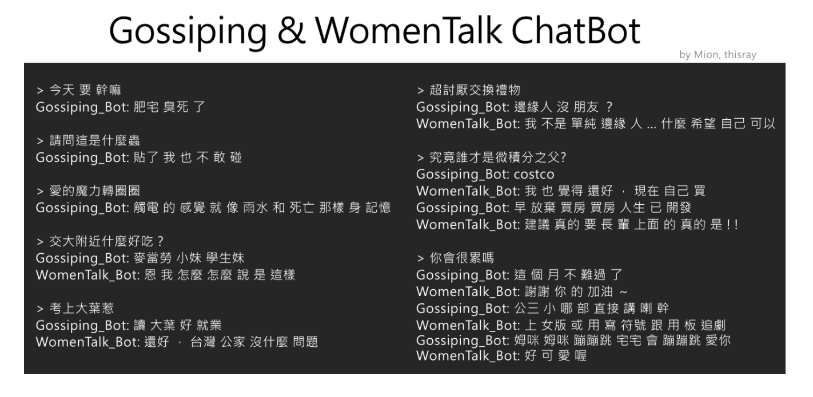

## Outline

> 1. __AI, Deep Learning, and the (unknown) Future__
> 2. Cognition, Computation, Linguistics and AI : a (mis)match in Heaven?
> 2. Semantic Network: Representation, Memory and Processing
> 3. AI, AAI and AW (Artificial Wisdom)?


---
## 時代背景：我的 ** 不是人


> 廚師、司機、醫師、健身教練、理專、律師、老師、情人(?)、。。。


---
## 常被大眾談論（與誤解）的例子

- 語音辨識 = 語言理解 
- (語音辨識 + 字串關聯比對的) 聊天機器人 = AI
- 人形機器人(android/humanoid) = AI


---
## `ASIMO`, `Boston Dynamics`, up and coming

<iframe width="560" height="315" src="https://www.youtube.com/embed/kbaDdg4LA9k?start=435" frameborder="0" allowfullscreen></iframe>


---
## 恐怖谷理論 (uncanny valley)，準嗎？

> 人類對機器人的好感度會隨著相似度增加，相似度高達 85% 時，會讓人心生恐懼與感到詭異。(森政弘,1970)


<iframe width="560" height="315" src="https://www.youtube.com/embed/3IFuv1AVouM" frameborder="0" allowfullscreen></iframe>

---
## 還是，[可愛與需要打敗一切恐懼](https://panx.asia/archives/47499)


(source: http://www.xenosystems.net/uncanny-valley/)


---
## 語音辨識
[Google Web Speech API Demonstration](https://www.google.com/intl/en/chrome/demos/speech.html)

> 繼 `語音` 之後，`語意`（理解）是關鍵。

---
## 其他的 AI 相關領域

- **知識搜尋處理**  決策、推薦、預測、推理、、
- **感知 (辨識)**  視覺（人臉、圖形、物件）、語音與語言、情緒、、
- **生成**  圖文詩詞自動生成、語音與音樂合成、娛樂商務與療癒對話、、

https://www.slideshare.net/ckmarkohchang/neural-art-english-version


---
## 其他參考

- [藏頭詩](https://github.com/ckmarkoh/AcrosticPoem)
- [歌詞/產生器](http://www.deepbeat.org) 
- [畫作](https://github.com/andersbll/neural_artistic_style)
- [Predicting Future Human Behavior with Deep Learning (Vondrick, 2016)]()


---
## Deep Learning and Language Technology


`Real Time American Sign Language Video Captioning using
Deep Neural Networks`


---
## 機器可以自學？**可以!**


---
## 機器可以自學？**可以嗎?**

- Elon Musk (Tesla) vs Mark Zuckerberg (FB)
- Singularity: AI 的高鐵過站隱喻。

> 當萬物皆可量度，我們都也只是一堆感測器 (Hsieh, 2017)


--- .cover .w #FitToWidth
## AI


---
## AI HERTORY: It all begins with ELIZA...


---
## ELIZA 加強版誰都可以實作

- 聊天機器人很多 <https://www.chatbots.org/>
- 真正處理「語言理解」的系統不多 (對於急需商業應用的人來說不是重點)
  - [Language-based AI](https://pat.ai/)


---
## 這不是我們所理解的「理解」吧？

 `YOU: My _1_ is _2_`   
 `ELIZA: How long has your _1_ been _2_ ?`
 
 
 `YOU: _1_ 覺得我很 _2_`  
 `CELIZA: 那妳覺得妳很 _2_ 嗎？`


---
##  資料夠大，即便神經網路模式也不一定穩定




---
## AI, Neural Network (aka Deep Learning)


---
## (End-to-End) AI 實作快變成中學生的課外活動


[Tensorflow playground](http://playground.tensorflow.org/)


---
## Keras: Deep Learning library in R or Python within 30 seconds

```{r, eval=FALSE}


```


---
## 但，我們應該假定這才是理解能力嗎

- **natural language processing** to enable it to communicate successfully;
- **knowledge representation** to store what it knows or hears;
- **automated reasoning** to use the stored information to answer questions and to draw new conclusions;
- **machine learning** to adapt to new circumstances and to detect and extrapolate patterns.


---
## 題外話

測試一下班上有沒有機器人:)

> 蜘蛛為何是白色的？
> 水手的工作？


---
## Deep Learning: a hype or go-to algorithm?

- [main criticism](https://www.quora.com/What-are-the-main-criticism-and-limitations-of-deep-learning)
- [concerns](https://blog.keras.io/the-limitations-of-deep-learning.html)

---
## Issues

- 不是每個領域都有可得的大數據 (big data)。
- 不是每個問題都有標準答案 (labeled data)。
- 理解活動可能不是單純的模型或是序列匹配 (pattern matching/seq2seq chatbot)
- AI 中的科學與工程 Science v.s./with Engineering?

[](https://www.quora.com/What-are-the-main-criticism-and-limitations-of-deep-learning)


---
## Last miles of the way ?

- Language understanding (vs. comprehension) and Linguistic complexity

> "human language is one of the most complex processes to be found anywhere on our planet" (Tomasello, 2008).

> Natural language understanding is sometimes referred to as an AI-complete or AI-hard problem, implying that the difficulty of these computational problems is equivalent to solving the central artificial intelligence problem. 


---
## [哲學思考] 丟一個問題給你，請想久一點 

如果有機器通過了圖林測試，它還是機器嗎？


<!--念哲學系的題目-->

> Loebner Prize Competition in Artificial Intelligence

---
## Talking to itself/themselves (娛樂效果之外的反思.....)

<iframe width="620" height="390" src="https://www.youtube.com/embed/WnzlbyTZsQY" frameborder="0" allowfullscreen></iframe>


---
## Outline

> 1. AI, Deep Learning, and the (unknown) Future
> 2. __Cognition, Computation, Linguistics and AI : a (mis)match in Heaven?__
> 2. Semantic Network: Representation, Memory and Processing
> 3. AI, AAI and AW (Artificial Wisdom)?


--- .shout #warning
# 識


--- 
## 人的歷程

> 認識、知識、常識、意識、心識


---
# 人的語言


---
## What is Linguistics?

- **目的**：語言學要回答語言的習得與發展,結構與功能,神經與心理機制,社會變異與演化過程等。
- **應用**： (大數據中的) 語言數據(語料)蘊含了文化歷史記憶,社會心理趨勢,政治輿情傾向,情緒偏好分佈,人格特質與決策行為,疾病前期徵兆等等。

順便澄清一個觀念：
> Asking a linguist how many languages they speak is like asking a doctor how many diseases they have (Lynne Murphy). 


---
## What is NLP?

經驗/計算語言學 (empirical/computational linguistics) [a.k.a. Natural Language Processing] 用電腦來幫助我們回答上述問題，並產生應用。

- Natural Language Processing (NLP)} is a field of computer science and linguistics concerned with the interactions between computers and human (natural) languages. It began as a branch of artificial intelligence, as a very attractive methodology of human–computer interaction. 


---
## 語言複雜度的處理

- 表徵與標記 (representation and annotation)
- 計算與學習 (modeling and machine learning)
- 模擬 (simulation)

以`計算詞彙語意學` (computational lexical semantics) 為例, 參考 2014 講義 [ai-lecture2014.pdf](https://db.tt/BzvIqk7e)


---
## 語言表徵與理解
### Semantic memory and categorization


- **Semantic memory**:  our organized knowledge about the world.
- **Concepts and Categories**: 
  - The feature approach
  - The prototype approach
  - The exemplar approach (your previous experience lumped together into a category)
  - The network models

> 定義遊戲練習


---
## Semantic memory

- general (common-sense) knowledge
- linguistic knowledge
- conceptual knowledge
  - Psychologists use the term concept to refer to your **mental representations** of a category (Murphy, 2010; Rips et al., 2012; Wisniewski, 2002). 

> Cognitive scientists have found it useful to draw a distinction between *declarative* (factual) knowledge and *procedural* knowledge.


---
## 「知識救援」的個人看法

- Human annotation/involvement *driven*
- Language and Knowwledge Resource *embedded*

---
## Machine Learning w/o Knowledge Representation and Annotation

- 爭辯熱度最高的主題
  - 標記（特徵工程）很貴、費工、太主觀
  - 標記（就算沒用）反映了科學的努力與限制；至少`我們`知道`他們`在幹什麼

---
## More on Levels of Annotation

Units (crossing the sentence boundary) reflect the communicative function of the sentence

- Topic-focus articulation/rhetorical structures and discourse connectives/anaphora and coreference 


---
## Topic-Focus Articulation (TFA)
- **Topic**: `What is the sentence about?`
  - The topic (or theme) is the part of the proposition that is being talked about (predicated). Once stated, the topic is therefore *old news*, i.e. the things already mentioned and understood. 
- **Focus**: `What information about the topic is asserted?` 
  - The focus determines which part of the sentence contributes the most important information. The focus may be highlighted either prosodically or syntactically or both, depending on the language.
- An important role is played by the position of the intonation marker.


--- 
## Deep (Linguistic) Learning: batteries included?

But, which Semantics?

- Lexical Semantics
- Neural Semantics
- Vector Semantics


---
## Network Representation of Semantics

<iframe width="520" height="415" src="assets/widgets/nn.html" frameborder="0" allowfullscreen></iframe>


---
## Network Analysis

`micro motifs and macro behavior`
- focuses on (in)dependent actors at the `micro level` and the consequences of their behavior at the `macro level`.
- *ideographic* approach stresses the uniqueness of a phenomenon; *nomothetic* approach stresses law-likeness.

---
## **Small worlds**: 
'six degrees of separation' (Watts and Strogatz, 1998)
```{r}
sw <- sample_smallworld(dim=2, size=10, nei=1, p=0.1)
plot(sw, vertex.size=6, vertex.label=NA, layout=layout_in_circle)
```

---
## Lexical network ([`Wordnet`]())


---
## Chinese Wordnet

- A network representation of lexical semantic knowledge in Chinese.
- Toward an OntoLex resource for Natural Language Processing.


---
## Vector Semantics

- Like the **neural language models**, the `word2vec` models learn embeddings by training
a network to predict neighboring words.


---
## Vector Semantics 
Word Embeddings

<!--
<iframe width="800" height="515" src="http://140.112.147.121:8288" frameborder="0" allowfullscreen></iframe>  -->

<!--  -->


---
## Neural Semantic Network
`Gallant lab Brain Viewer`


---
## Neural Semantic Network


---
## Human Connectome Project (HCP)

> a [consortium](https://www.humanconnectome.org/) whose goal is to map “human brain circuitry in a target number of 1200 healthy adults using cutting-edge methods of noninvasive neuroimaging” 


---
## Neural WordNet

- Neurologically-based Ontology and Semantic Space (Huth et al. 2012; Huth et al. 2016, Nature
) Brain altas: same with Chinese?


https://www.youtube.com/watch?v=0FDtsbLZBuM 


---
## **(Words/Chunks?) on the Brain: A Semantic Map of the Cortex**

DeepMind 的 leader 要跟神經科學學習 / Hinton 認為 back-propagation 要打掉重練


<iframe width="560" height="315" src="https://www.youtube.com/embed/k61nJkx5aDQ" frameborder="0" allowfullscreen></iframe>


---
## Chinese QIEs

- Is Construction Grammar Neuroscientifically Plausible? 

<!--
```{r, echo=FALSE}
library(oro.nifti)
img <- readNIfTI("~/Dropbox/心智科學腦影像計畫子計畫3/實驗.程式.資料/Neural.data/fMRI.data.analysis/example/Template-T1-U8-RALPFH-BR.nii.gz", reorient = FALSE)
image(img, z = 225, plot.type = "single")

```
-->

---
## Chinese QIEs

```{r}
#orthographic(img)
```


---
## Chinese QIEs

- Idiom, Near, Far conditions were contrasted against random condition. 
- BOLD signal increase:
  - Idiom condition: left and right AG (angular gyrus), PCC (posterior cingulate cortex)
  - Near conditions at left AG and IFG (left Inferior frontal gyrus )
  - No significant difference found in Far vs. Random condition.


---
## 結論，有嗎之一
### AI needs greater representation from the humanities

- 人的問題涉及行為、經驗、心靈、意識、生理變化等。
- 語言裡反映了慾望、記憶與遺忘、錯誤、情緒、愛、性格。

> 再確認：妳是人嗎
下面這句話一秒鐘看完並說出意思
[賣女孩的小火柴][請上獎領台]
 
    
---
## 結論，有嗎之二
### call for 同理計算 (computational empathetic communication) 
`人格面具,自我實現、善心、惻隱之心、同情心、助人、愛心、民主、創造、幽默、風趣、詼諧、恐懼、自卑、氣質、非理性決策（直覺`


---
## 結論，有嗎之三
### From AI (人工智能) to AW (人工智慧)

- 馬失業之後應該比較開心過馬的生活。
- 人是什麼？機器是什麼？是變動的定義。
> Kurzweil預計到 2030 年人類都會進化成半機械人（Elon Musk的 人機合一正是這項實驗， `Neurolink`），通過神經系統進入虛擬現實（VR）世界。事實上，AI早已改變人類行為。傳播學者 McLuhan 提出「人的延伸」，智慧手機就是「大腦延伸」。

---
## 結論，有嗎之四


---
## Reference

[1] Huth AG, de Heer WA, Griffiths TL, Theunissen FE, & Gallant JL (2016). Natural speech reveals the semantic maps that tile human cerebral cortex. Nature, 532 (7600), 453-8 PMID: 27121839

[2] Friedemann Pulvermüller, Bert Cappelle and Yury Shtyrov. (2013). Brain basis of meaning, words, constructions, and grammar. In: Graeme Trousdale and Thomas Hoffmann (eds.), Oxford Handbook of Construction Grammar. Oxford: Oxford University Press, 397-416. 


